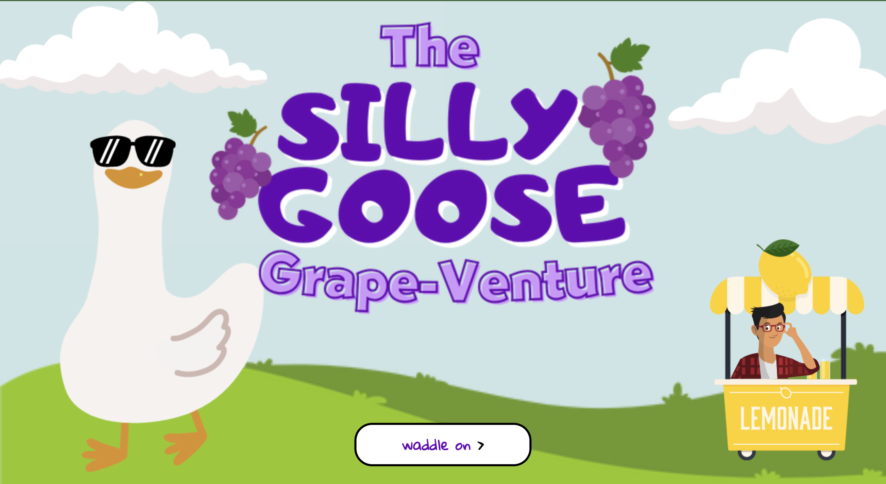

# The Silly Goose Grape-Venture

The Silly Goose Grape-Venture is a fun and whimsical Choose Your Own Adventure game inspired by the viral "Duck Song" that captivated early internet meme culture in 2009. In this interactive game, you step into the webbed feet of a silly goose on a quest for something to do and, hopefully, a delightful bunch of grapes to munch on. In this game, you will be presented with many choices at the bottom of the screen that will either lead you closer to the next stage of your quest or to an amusing game over. Some choices will move you forward to the next choice, while others will result in a game over. As a callback to the original internet song that inspired this game, there's no definitive way to "win," and you might find yourself caught in a silly loop as you continuously search for those elusive grapes.

## Play the Game Here 🦆
https://the-silly-goose-grapeventure.netlify.app/

## Technologies Used
- CSS
- JavaScript
- HTML
- Git

## Credits

### Inspiration
This choose-your-own-adventure game is inspired by The Duck Song by forrestfire101 on YouTube. You can watch it here: (https://youtu.be/MtN1YnoL46Q?si=cItbawBQU-IUd2Ge).

### Audio Credits:
The audio files used in this game are sourced from the following sources on freesound.org:
- https://freesound.org/people/crazyduckman/sounds/185549/
- https://freesound.org/people/JPBILLINGSLEYJR/sounds/476542/
- https://freesound.org/people/Benboncan/sounds/73581/

### Image Credits:
All images are sourced from Canva.com. The logo was created in Canva, and additional images were sourced from various artists in Canva, available for use by Canva Pro members.
- All goose images by PakkaDesign Studio
- Cloud images by Ala Nurmalaa
- Road by Arif from Corrohero
- Lake by Trendify
- Grass hill by Procrea
- Lemonade Stand by Olesia_g
- Man by jemastock

### Animation Credits:
All animations are downloaded from https://animate.style/

## Ice Box 🧊
 - [ ] Add an additional story loop option that appears after you have been through the 'Do you have any grapes' loop a few times, unlocking the opportunity to go to the store with the lemonade stand owner and ask if they sell lemonade there (inspired by The Duck Song).
 - [ ] Update the design to be more responsive and look good on multiple screen sizes.
 - [ ] Add more animations to make the story feel more "alive."