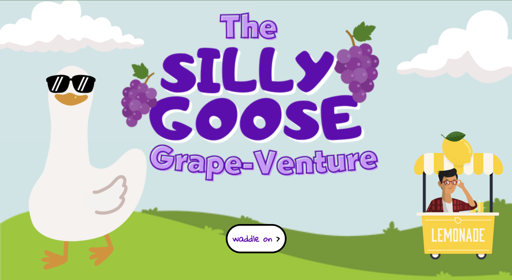

# The Silly Goose Grape-Venture

The Silly Goose Grape-Venture is a Choose Your Own Adventure game based on the once viral "Duck Song" that took the early internet by storm in 2009. In this game you will play a silly goose who is searchingn for something to do and hopefully some grapes to eat on a warm sunny day. After starting the game, you will be moved through several screens with two different choices at the bottom. Some choices will move you forward to the next choice, while others will result in a game over. As a callback to the original internet song this game is based off of, there is no true way to win this game and you can get stuck in an endless loop looking for grapes.

## Play the game here
https://the-silly-goose-grapeventure.netlify.app/

## Technologies used
- CSS
- JavaScript
- HTML
- git

## Credits

### Inspiration
This choose your own adventure game is inspired by The Duck Song by forrestfire101 on YouTube. You can watch it yourself here (https://youtu.be/MtN1YnoL46Q?si=cItbawBQU-IUd2Ge).

### Audio Credits:
I got these audio files from freesound.org 
- https://freesound.org/people/crazyduckman/sounds/185549/
- https://freesound.org/people/JPBILLINGSLEYJR/sounds/476542/
- https://freesound.org/people/Benboncan/sounds/73581/

### Image Credits:
All images are sourced from Canva.com. The logo I created myself in Canva, and I sourced the additional images from artists in canva, which are free for use by Canva Pro members.
- All goose images are by PakkaDesign Studio
- Cloud images are by Ala nurmalaa
- Road is by Arif from Corrohero
- Lake is by Trendify
- Grass hill is by Procrea
- Lemonade Stand ys by Olesia_g
- Man is by jemastock

### Animation Credits:
All animations are downloaded from https://animate.style/

## Ice Box
 - [ ] Adding an additional story loop option that appears after you have been through the 'Do you have any grapes' loop three times that unlocks going to the store with the lemonade stand owner and asking him if they sell lemonade there (inspired by The Duck Song)
 - [ ] Update design to be more repsonsive and look good on multiple sizes of screens
 - [ ] Add more animations to make the story feel more "alive"

